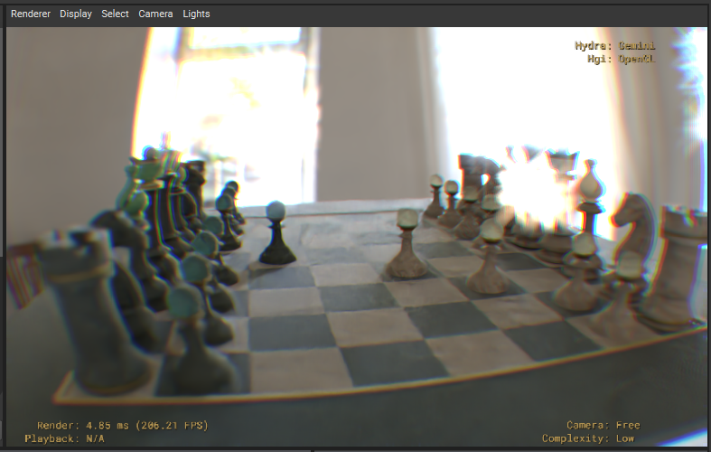

# hdGemini

**hdGemini** is a custom Hydra Render Delegate for Pixar's Universal Scene Description (USD). It implements a CPU-based, physically-based Monte Carlo path tracer designed to seamlessly integrate into Hydra-based viewports like `usdview`.

<p align="center">
  
  
</p>
<p align="center">
  
  
</p>

## Features

- **Spectral Monte Carlo Path Tracing**: Full global illumination via stochastic path tracing operating natively in the spectral domain.
  - Utilizes **Hero Wavelength Sampling** to efficiently evaluate 4 continuous wavelengths per ray, eliminating metamerism and enabling true physical color mixing.
  - **Light Transport**:
    - **Microfacet GGX Importance Sampling**: Analytically matches the material's Normal Distribution Function (NDF) across all specular layers (Base Reflection, Coat, Sheen, and Transmission/Refraction) to massively accelerate specular convergence.
    - **Multiple Importance Sampling (MIS)**: Integrates Direct Light Sampling (Next Event Estimation) with Indirect BSDF Sampling using the Power Heuristic. Explicitly combining the light's PDF and the material's BSDF PDF eliminates fireflies and rapidly resolves noisy lighting interactions.
    - Path termination is efficiently handled via Russian Roulette.
  - Incoming RGB textures are on-the-fly "uplifted" to continuous spectra using a smooth, optimized Gaussian basis. Scalar maps (normal, roughness, metallic) are meticulously preserved in raw RGB space to avoid precision loss.
- **AI Denoising Pipeline**:
  - The denoising pipeline is split into three modular, independently toggleable stages within the `usdview` UI, allowing interactive adjustment without clearing path-tracing samples:
    1. **Smart Firefly Filter**: A custom pre-pass that dynamically scans 3x3 pixel neighborhoods to clamp high-variance, unresolved energy spikes.
    2. **Chromaticity Blur**: Translates the image into YCoCg color space to spatially blur the Co and Cg channels. This aggressively eliminates multi-colored path-tracing noise while perfectly preserving structural luminance sharpness.
    3. **Intel Open Image Denoise (OIDN)**: The core AI neural network (v2.2.2) executes on the exceptionally stable pre-filtered input, preventing artifacting and producing pristine images.
  - Automated binary download and linking via `FetchContent` in CMake.
  - Custom AOVs (`albedo`, `normal`) seamlessly extract unlit color and shading normals on the first bounce to guide the denoiser.
  - Full Float32 HDR color AOV output preserving unclamped highlights for post-processing.
- **Physical Materials**: Extensive support for physically-based rendering workflows.
  - Prioritized resolution for **MaterialX** (`mtlx`) and **OpenPBR** surface shaders via the SdrRegistry.
  - Full `standard_surface` support including Base Color, Roughness, Metallic, Clearcoat, Sheen, Subsurface Scattering (diffuse approximation, globally toggleable via render settings), and physical Emission.
  - Accurate physical refraction, handling Transmission, IOR (Index of Refraction), Transmission Depth/Scatter (Beer's Law volume absorption), and Thin-Walled properties.
  - **Physical Dispersion**: Simulates wavelength-dependent Index of Refraction (IOR) using Cauchy's equation, rendering accurate rainbow dispersion through transmissive materials.
- **Physical Camera & Optical Effects**:
  - **Depth of Field**: Accurate synthetic lens sampling with configurable Focal Length, F-Stop, Focus Distance, and polygonal Bokeh Blades.
  - **Physical Exposure**: Image luminance scaling based on photographic EV100 equations (ISO, Shutter Speed, Aperture).
  - **Optical Distortion**: Radial Lens Distortion (barrel/pincushion) evaluated accurately during primary ray generation.
  - **Post-Processing**: Integrated Chromatic Aberration and HDR Lens Flare (bloom) applied cleanly after the AI denoising pass.
  - **Interactive Post-Process Optimization**: Tweaking post-processing settings (Denoiser, Lens Flare, Chromatic Aberration) reinstates the pristine, accumulated HDR data from a background buffer instead of clearing the path-tracing samples, enabling real-time interactive optical adjustments.
  - All camera effects and rendering toggles (like hiding the IBL background) are dynamically exposed and adjustable in real-time within `usdview`'s Render Settings panel.
- **Advanced Geometry Handling**:
  - Robust **GeomSubset** splitting: Multi-material meshes are physically partitioned into isolated sub-meshes under the hood, ensuring perfect sub-mesh material assignments even with complex n-gon encodings.
  - **Face-Varying Primvars**: Accurate slicing and interpolation of UVs, normals, and vertex colors for all mesh subsets.
  - Smooth shading via computed and triangulated vertex normals.
  - Support for animated meshes via ExtComputations (e.g., skinning).
- **Lighting**:
  - Full suite of Hydra light types: Distant, Rect, Sphere, Point, and Dome lights.
  - Advanced **Spot Light Shaping**: Supports cone angle, cone softness, and smoothstep falloff.
  - HDR **Dome Light Importance Sampling**: Generates a 2D CDF from environment maps to aggressively sample bright regions, greatly reducing noise.
  - **Physical Sky & Sun IBL**: Analytical atmospheric scattering model (Rayleigh and Mie) alongside a procedural directional Sun, driven dynamically by a 'Time of Day' render setting for realistic sunrises, midday, and sunsets.
- **Architecture & Performance**:
  - Accelerated Ray Tracing using an optimized iterative Top-Level Acceleration Structure (TLAS) and localized Bounding Volume Hierarchies (BVH) per sub-mesh.
  - Native instancing support via `HdInstancer`.
  - Thread-safe, lazy-loaded texture caching via `HioImage`.
  - Progressive, interactive rendering with multi-threaded bucketing.

## Building and Running

Ensure you have a recent version of Pixar's USD built and accessible on your system (the CMake configuration assumes USD 26.03 by default, but this can be overridden).

```cmd
# Compile the plugin
.\compile.bat

# Launch usdview with the hdGemini render delegate
.\launch_gemini.bat
```

## Architecture Notes

hdGemini intercepts the Hydra synchronization phase to extract standard `HdMesh`, `HdMaterial`, and `HdLight` data. 
- During `Sync`, meshes with multiple materials via `GeomSubsets` are actively split, and their face-varying primvars (like UVs) are meticulously separated and stored into contiguous arrays.
- The `HdGeminiRenderer` uses `WorkParallelForN` to dispatch screen buckets to multiple threads.
- `_TraceRay` leverages an iterative, stack-based TLAS traversal to rapidly identify bounding box intersections before delegating to individual BVHs, maintaining O(1) direct light lookups and deep recursion paths.
