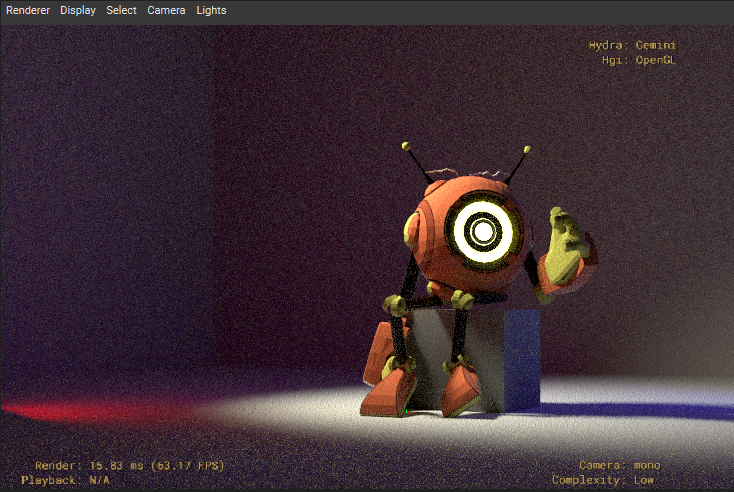
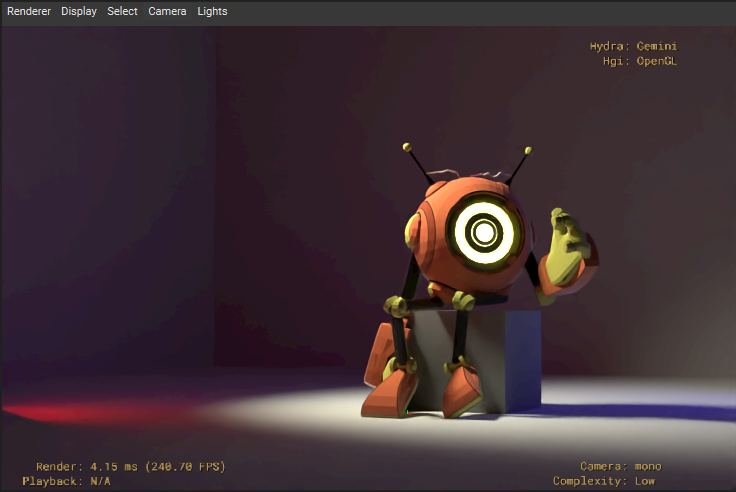
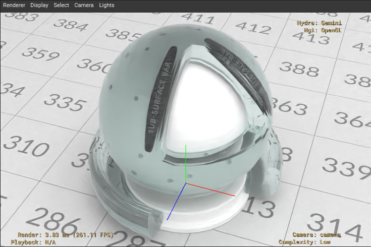
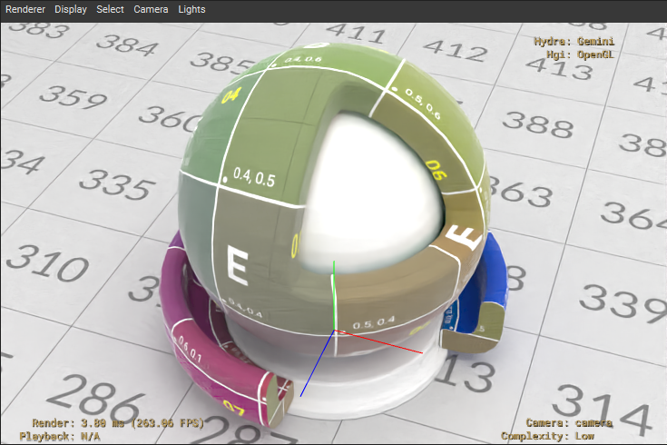

# hdGemini

**hdGemini** is a custom Hydra Render Delegate for Pixar's Universal Scene Description (USD). It implements a CPU-based, physically-based Monte Carlo path tracer designed to seamlessly integrate into Hydra-based viewports like `usdview`.

<p align="center">
  
  
</p>
<p align="center">
  
  
</p>

## Features

- **Monte Carlo Path Tracing**: Full global illumination via stochastic path tracing, featuring Multiple Importance Sampling (MIS) using the power heuristic and Russian Roulette for robust, unbiased rendering.
- **AI Denoising Pipeline**:
  - Integrated **Intel Open Image Denoise (OIDN)** v2.2.2 for rapid noise reduction.
  - Automated binary download and linking via `FetchContent` in CMake.
  - Custom AOVs (`albedo`, `normal`) seamlessly extract unlit color and shading normals on the first bounce to guide the denoiser.
  - Interactive Hydra Render Settings controls: `Enable Denoiser` and `Target Sample Count` directly exposed in the `usdview` UI.
- **Physical Materials**: Extensive support for physically-based rendering workflows.
  - Prioritized resolution for **MaterialX** (`mtlx`) and **OpenPBR** surface shaders via the SdrRegistry.
  - Accurate physical refraction, handling Transmission, IOR (Index of Refraction), and Transmission Color (tinting).
  - Fresnel (dielectric) reflections and specular roughness support.
- **Advanced Geometry Handling**:
  - Robust **GeomSubset** splitting: Multi-material meshes are physically partitioned into isolated sub-meshes under the hood, ensuring perfect sub-mesh material assignments even with complex n-gon encodings.
  - **Face-Varying Primvars**: Accurate slicing and interpolation of UVs, normals, and vertex colors for all mesh subsets.
  - Smooth shading via computed and triangulated vertex normals.
  - Support for animated meshes via ExtComputations (e.g., skinning).
- **Lighting**:
  - Full suite of Hydra light types: Distant, Rect, Sphere, Point, and Dome lights.
  - Advanced **Spot Light Shaping**: Supports cone angle, cone softness, and smoothstep falloff.
  - HDR **Dome Light Importance Sampling**: Generates a 2D CDF from environment maps to aggressively sample bright regions, greatly reducing noise.
- **Architecture & Performance**:
  - Accelerated Ray Tracing using an optimized iterative Top-Level Acceleration Structure (TLAS) and localized Bounding Volume Hierarchies (BVH) per sub-mesh.
  - Native instancing support via `HdInstancer`.
  - Thread-safe, lazy-loaded texture caching via `HioImage`.
  - Progressive, interactive rendering with multi-threaded bucketing.

## Building and Running

Ensure you have a recent version of Pixar's USD built and accessible on your system (the CMake configuration assumes USD 26.03 by default, but this can be overridden).

```cmd
# Compile the plugin
.\compile.bat

# Launch usdview with the hdGemini render delegate
.\launch_gemini.bat
```

## Architecture Notes

hdGemini intercepts the Hydra synchronization phase to extract standard `HdMesh`, `HdMaterial`, and `HdLight` data. 
- During `Sync`, meshes with multiple materials via `GeomSubsets` are actively split, and their face-varying primvars (like UVs) are meticulously separated and stored into contiguous arrays.
- The `HdGeminiRenderer` uses `WorkParallelForN` to dispatch screen buckets to multiple threads.
- `_TraceRay` leverages an iterative, stack-based TLAS traversal to rapidly identify bounding box intersections before delegating to individual BVHs, maintaining O(1) direct light lookups and deep recursion paths.
