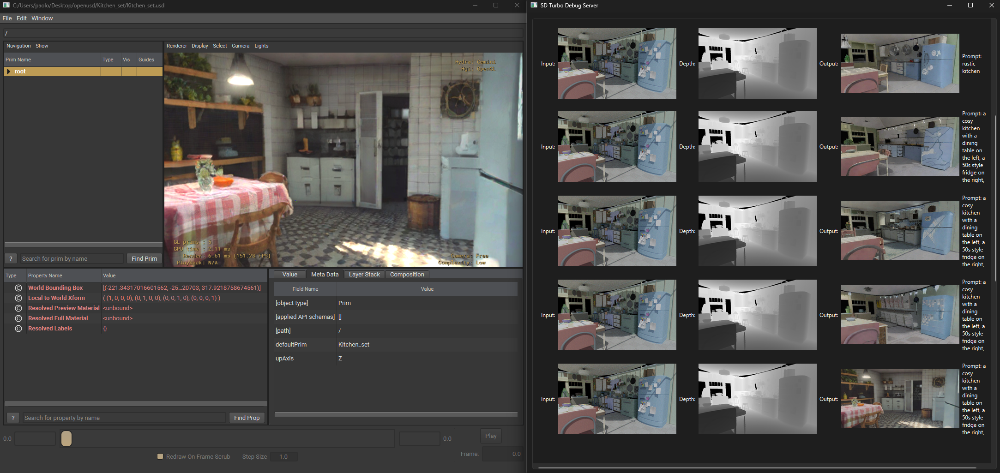
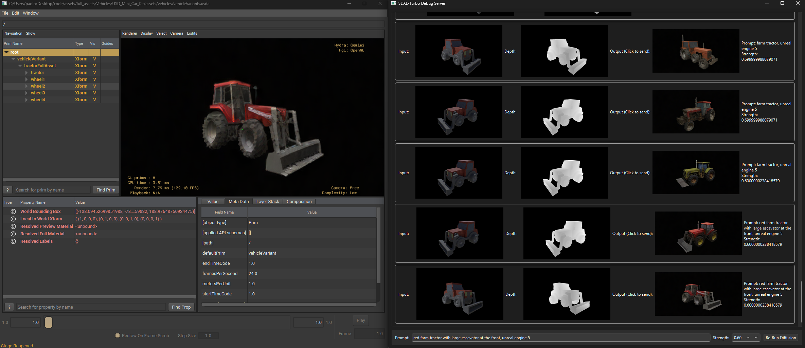
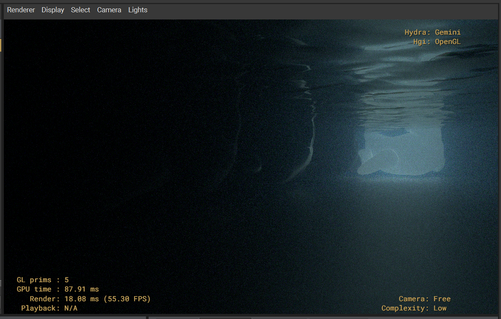
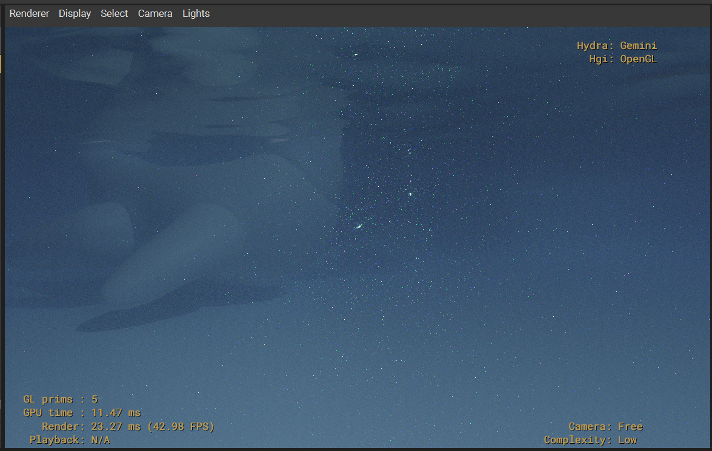
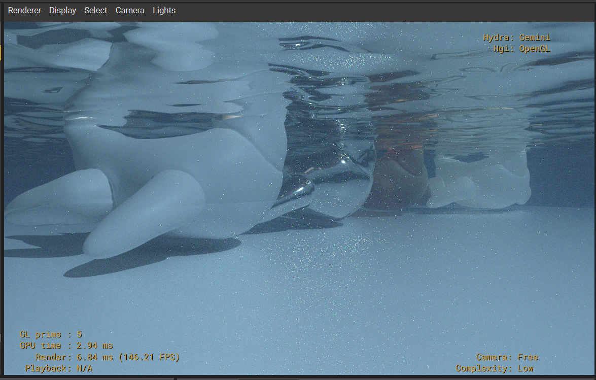
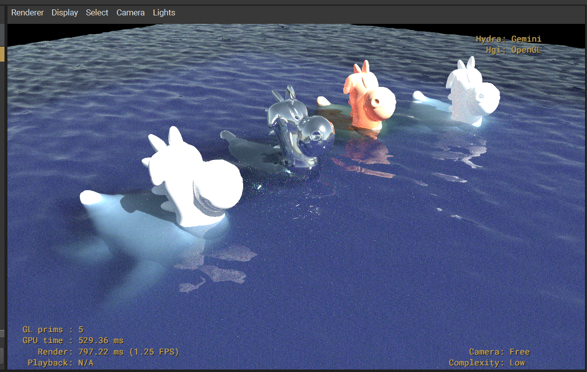
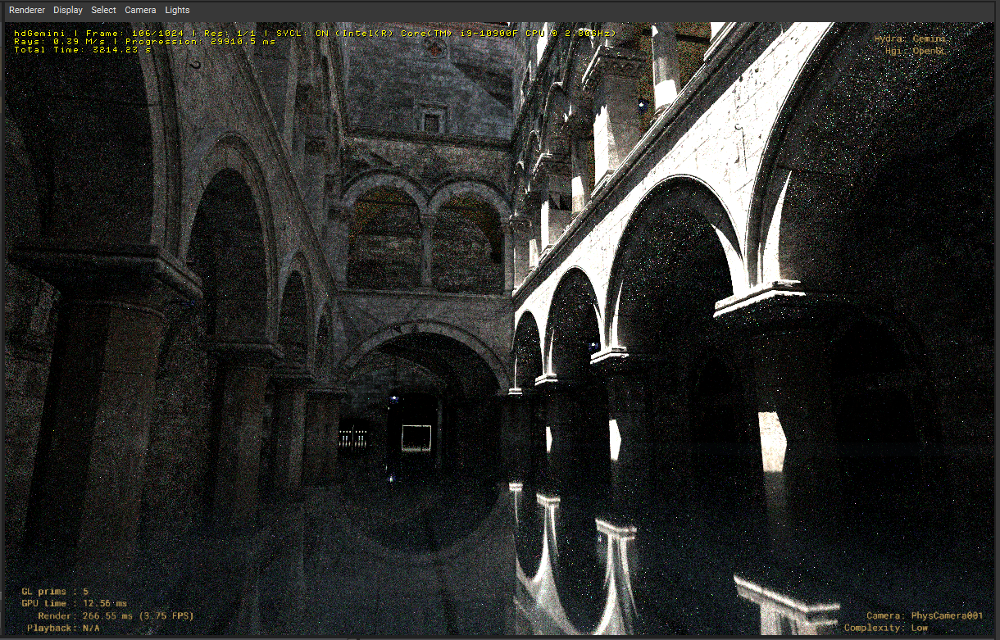
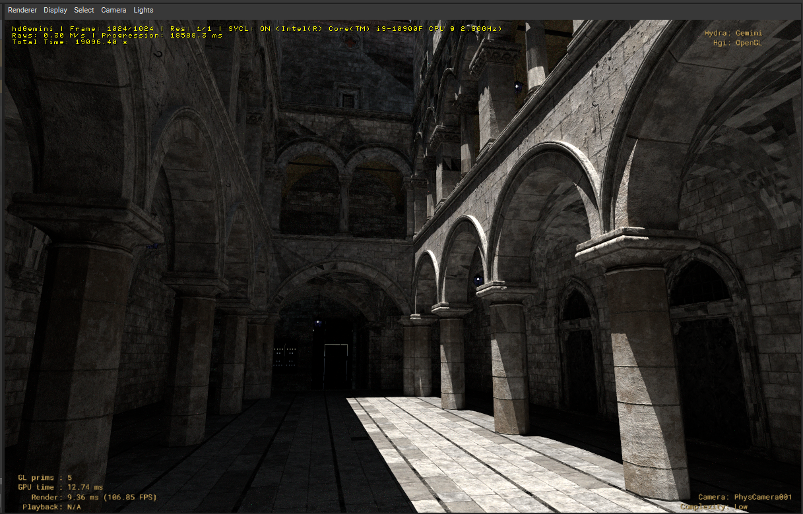
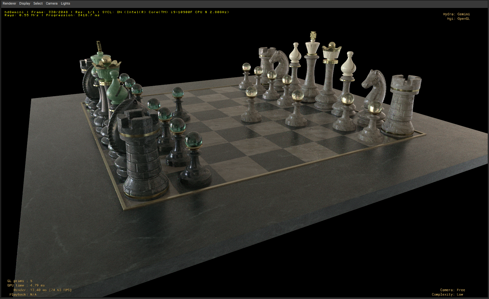

# hdGemini

**hdGemini** is a custom Hydra Render Delegate for Pixar's Universal Scene Description (USD). It implements a CPU-based, physically-based Monte Carlo path tracer designed to seamlessly integrate into Hydra-based viewports like `usdview`.

## Features

- **Spectral Monte Carlo Path Tracing**: Full global illumination via stochastic path tracing operating natively in the spectral domain.
  - Utilizes **Hero Wavelength Sampling** to efficiently evaluate 4 continuous wavelengths per ray, eliminating metamerism and enabling true physical color mixing.
  - **Light Transport**:
    - **Microfacet GGX Importance Sampling**: Analytically matches the material's Normal Distribution Function (NDF) across all specular layers (Base Reflection, Coat, Sheen, and Transmission/Refraction) to massively accelerate specular convergence.
    - **Multiple Importance Sampling (MIS)**: Integrates Direct Light Sampling (Next Event Estimation) with Indirect BSDF Sampling using the Power Heuristic. Explicitly combining the light's PDF and the material's BSDF PDF eliminates fireflies and rapidly resolves noisy lighting interactions.
    - Path termination is efficiently handled via Russian Roulette.
  - Incoming RGB textures are on-the-fly "uplifted" to continuous spectra using a smooth, optimized Gaussian basis. Scalar maps (normal, roughness, metallic) are meticulously preserved in raw RGB space to avoid precision loss.
- **AI Denoising Pipeline (Hero Wavelength Demultiplexing)**:
  - hdGemini implements a full spectral demultiplexing pipeline to handle dispersion noise before AI denoising. The path-traced spectrum is separated into structural luminance ("Hero" wavelength) and chromatic variance ("Difference" spectrum).
  - The denoising pipeline is split into three modular, independently toggleable stages within the `usdview` UI, allowing interactive adjustment without clearing path-tracing samples:
    1. **Smart Firefly Filter**: Applied exclusively to the structural Hero buffer. Dynamically scans 3x3 pixel neighborhoods to clamp high-variance, unresolved energy spikes without affecting color.
    2. **Spectral Difference Blur**: A spatial blur applied exclusively to the Spectral Difference buffer. This aggressively eliminates severe multi-colored dispersion noise while perfectly preserving edge sharpness in the structural buffer.
    3. **Intel Open Image Denoise (OIDN)**: The Hero and Difference buffers are recombined into a pristine, pre-filtered RGB image, which is then fed into the core AI neural network (v2.2.2) to produce the final output.
  - Automated binary download and linking via `FetchContent` in CMake.
  - Custom AOVs (`albedo`, `normal`) seamlessly extract unlit color and shading normals on the first bounce to guide the denoiser.
  - Full Float32 HDR color AOV output preserving unclamped highlights for post-processing.
- **Generative AI Image-to-Image Pipeline (Stable Diffusion XL Turbo)**:
  - hdGemini integrates a highly specialized **Generative AI** workflow directly into `usdview`. 
  - Real-time rendering output (including Beauty, Albedo, Normal, and Depth AOVs) is actively piped via binary stream to a standalone Python PySide6 Server running `stabilityai/sdxl-turbo`.
  - The Python server strictly maps the HDR linear path-traced output into sRGB LDR space using a custom Reinhard curve before passing it as an `init_image` to the SDXL-Turbo neural network, returning breathtaking stylized renders in real-time.
  - **Standalone Interactive UI**: The Python server features a fully standalone UI to scrub prompt strength, type custom textual descriptions, and interactively browse a history of generations without forcing the C++ renderer to continuously trace the scene.
  - Generative images are asynchronously flushed back into the `usdview` viewport, retaining the exact camera aspect ratios, lens distortion, and optical alignment.
- **Physical Materials**: Extensive support for physically-based rendering workflows.
  - Prioritized resolution for **MaterialX** (`mtlx`) and **OpenPBR** surface shaders via the SdrRegistry.
  - Full `standard_surface` support including Base Color, Roughness, Metallic, Clearcoat, Sheen, Volumetric Subsurface Scattering (full Monte Carlo random walk), and physical Emission.
  - **Extended Texture Support**: Fully supports `ND_extract` nodes for channel-packed textures (e.g., ORM - Occlusion, Roughness, Metallic) and correct routing for Opacity and Transmission maps.
  - Accurate physical refraction, handling Transmission, IOR (Index of Refraction), Transmission Depth/Scatter (Beer's Law volume absorption), and Thin-Walled properties.
  - **Nested Dielectrics**: True Index of Refraction (IOR) tracking stack across intersecting transparent volumes (e.g., ice inside water) to ensure perfectly accurate physical light bending without geometric artifacting.
  - **Physical Dispersion**: Simulates wavelength-dependent Index of Refraction (IOR) using Cauchy's equation, rendering accurate rainbow dispersion through transmissive materials.
  - **True Volumetric Rendering**: Support for NanoVDB parsing, allowing for heterogeneous media rendering, ray-marching, and Woodcock delta-tracking for efficient stochastic volume scattering.
  - **Robust Defaults**: Unassigned geometry intelligently defaults to a 0.5-grey Lambertian surface, avoiding unnatural shading artifacts.
- **Physical Camera & Optical Effects**:
  - **Depth of Field**: Accurate synthetic lens sampling with configurable Focal Length, F-Stop, Focus Distance, and polygonal Bokeh Blades.
  - **Physical Exposure**: Image luminance scaling based on photographic EV100 equations (ISO, Shutter Speed, Aperture).
  - **Optical Distortion**: Radial Lens Distortion (barrel/pincushion) evaluated accurately during primary ray generation.
  - **Post-Processing**: Integrated Chromatic Aberration and HDR Lens Flare (bloom) applied cleanly after the AI denoising pass.
  - **Interactive Post-Process Optimization**: Tweaking post-processing settings (Denoiser, Lens Flare, Chromatic Aberration) reinstates the pristine, accumulated HDR data from a background buffer instead of clearing the path-tracing samples, enabling real-time interactive optical adjustments.
  - All camera effects and rendering toggles (like hiding the IBL background) are dynamically exposed and adjustable in real-time within `usdview`'s Render Settings panel.
  - **On-Screen Statistics**: Optional heads-up display overlaying current progression frame, target samples, active resolution, SYCL acceleration status, raw rays per second (Millions/s), duration of the latest frame progression, and **total accumulated render time**.
- **Advanced Geometry Handling**:
  - Robust **GeomSubset** splitting: Multi-material meshes are physically partitioned into isolated sub-meshes under the hood, ensuring perfect sub-mesh material assignments even with complex n-gon encodings.
  - **Face-Varying Primvars**: Accurate slicing and interpolation of UVs, normals, and vertex colors for all mesh subsets.
  - Smooth shading via computed and triangulated vertex normals, featuring mathematically exact normal transformations that gracefully handle non-uniform mesh scaling.
  - Seamless handling of `leftHanded` vs `rightHanded` mesh orientation via correct winding order adjustments and tangent space synchronization for accurate normal mapping regardless of topology.
  - Support for animated meshes via ExtComputations (e.g., skinning).
  - **Procedural FFT Oceans**: Dynamically generated, animated ocean waves utilizing Fast Fourier Transforms (FFT) directly within the render delegate.
    - **Global & Per-Prim Modes**: Can be enabled globally (generating an infinite ocean plane) or applied directly to user-authored mesh prims.
    - **3-Cascade Spectral Simulation**: The ocean displacement is evaluated as a sum of 3 separate FFT cascades (Long, Medium, and Detailed/Crisp waves), evaluated over a physical Phillips spectrum. Each cascade independently controls its amplitude, choppiness, physical size, minimum/maximum frequency bands (`minK`, `maxK`), and wind parameters.

    - **Adaptive Subdivision**: Per-prim authored ocean geometry seamlessly integrates with OpenSubdiv, allowing low-poly base meshes to be cleanly subdivided and refined before dynamic FFT displacement is applied.
    - **Camera-Centered Exponential Grid LOD**: Uses a seamless exponential grid centered on the camera to dynamically concentrate infinite resolution at the viewer's location without any tiling or gaps. The grid seamlessly translates with the camera without requiring costly topology re-dicing, ensuring maximum performance while retaining massive geometric details up close.
    - **Dynamic Foam & Multilayered Shader**: Features a dynamic Jacobian-based foam generation system with sharpened power curves, evaluated on-the-fly during wave displacement. The water shader utilizes a physically accurate multilayered approach, combining volumetric transmission with a high-IOR Clearcoat layer for realistic shiny surface reflections.
    - Fully configurable parameters available dynamically via USD Render Settings and Primvars: Per-cascade Wind Speed/Direction, Size, Amplitude, Choppiness, and frequency bands.
    - Supports an `oceanRepeat` toggle to seamlessly repeat the simulated wave patch infinitely or cleanly constrain it to a single localized tile.
    - Includes a built-in diagnostic mode: disabling the shader on the ocean dynamically visualizes the raw per-micropolygon dicing density via random solid colors for rapid LOD tuning.
- **Lighting**:
  - Full suite of Hydra light types: Distant, Rect, Sphere, Point, and Dome lights.
  - Advanced **Spot Light Shaping**: Supports cone angle, cone softness, and smoothstep falloff.
  - HDR **Dome Light Importance Sampling**: Generates a 2D CDF from environment maps to aggressively sample bright regions, greatly reducing noise.
  - **Light Power Sampling**: Dynamically builds a CDF of all active lights based on their radiant flux, drastically reducing variance in multi-light scenes by importance-sampling bright lights.
  - Environment mapping perfectly matches Pixar's `PxrDomeLight` orientation standards out of the box (+Z center with corrected UV lat-long projections).
  - **Physical Sky & Sun IBL**: Analytical atmospheric scattering model (Rayleigh and Mie) alongside a procedural directional Sun, driven dynamically by Azimuth and Altitude render settings for realistic sunrises, midday, and sunsets.
- **Architecture & Performance**:
  - Accelerated Ray Tracing using an optimized iterative Top-Level Acceleration Structure (TLAS) and localized Bounding Volume Hierarchies (BVH) per sub-mesh.
  - Native instancing support via `HdInstancer`.
  - Thread-safe, lazy-loaded texture caching via `HioImage`.
  - Progressive, interactive rendering with multi-threaded bucketing.
  - **Adaptive Sampling**: Dynamically tracks per-pixel variance on the fly using Welford-like variance buffers. Automatically culls fully converged pixels from the active sample loop, vastly accelerating renders of scenes with large uniform areas (like walls or skies) while focusing processing power on noisy specular highlights and complex geometry.
  - **Low-Discrepancy Sequences (LDS)**: Replaces standard pseudo-random number generators with highly stratified **Halton and Van der Corput** Quasi-Monte Carlo sequences. This produces structured, film-like grain that converges drastically faster than white noise and plays beautifully with AI denoisers.
  - **Anti-Aliasing Filter**: 4 configurable anti-aliasing modes (None, Box, Tent, Gaussian) to handle sub-pixel jitter and smooth edge rendering.

## Building and Running

hdGemini uses CMake and supports a **Hybrid CPU/GPU Wavefront Architecture** to massively accelerate rendering.

### GPU Acceleration (Highly Recommended)
hdGemini utilizes **SYCL** via the **Intel oneAPI Base Toolkit** to offload primary ray generation and massive BSDF evaluations to the GPU, while keeping out-of-core geometry safely on the CPU.
1. Download and install the [Intel oneAPI Base Toolkit](https://www.intel.com/content/www/us/en/developer/tools/oneapi/base-toolkit.html) (Free).
2. The `compile.bat` script will automatically detect the installation at the default path (`C:\Program Files (x86)\Intel\oneAPI\setvars.bat`) and compile the GPU kernels using `icx`.

### CPU-Only Fallback
If you do not have Intel oneAPI installed, the `compile.bat` script will gracefully fall back to the standard MSVC compiler, utilizing a highly optimized, fully functional CPU-only Megakernel path tracer.

```cmd
# Compile the plugin (auto-detects SYCL if available)
.\compile.bat

# Launch usdview with the hdGemini render delegate
.\launch_gemini.bat
```

### usdview Plugin
hdGemini includes a native `usdview` plugin accessible via the **Gemini** menu item. This plugin allows you to easily create a custom `RenderSettings` prim and interactively edit its properties in a clean, categorized UI.
> [!NOTE]
> **Change Tracking Workaround**: Certain versions of OpenUSD's `UsdImaging` adapter have limitations correctly broadcasting updates when custom `namespacedSettings` change. If your edits in the Prim Editor do not immediately trigger a viewport update, click the **Force Update** button at the bottom of the editor. This instantly drops and re-adds the prim in Hydra, guaranteeing a clean synchronization of your edited settings.

## Architecture Notes

hdGemini intercepts the Hydra synchronization phase to extract standard `HdMesh`, `HdMaterial`, and `HdLight` data. 
- During `Sync`, meshes with multiple materials via `GeomSubsets` are actively split, and their face-varying primvars (like UVs) are meticulously separated and stored into contiguous arrays.
- The `HdGeminiRenderer` uses `WorkParallelForN` to dispatch screen buckets to multiple threads.
- `_TraceRay` leverages an iterative, stack-based TLAS traversal to rapidly identify bounding box intersections before delegating to individual BVHs, maintaining O(1) direct light lookups and deep recursion paths.

## Gallery



<p align="center">
  
  
</p>
<p align="center">
  
  
</p>
<p align="center">
  
  
</p>
<p align="center">
  
  
</p>
<p align="center">
  
  
</p>
<p align="center">
  
  
</p>

## Installation Directory Structure

hdGemini compiles and installs its binaries and plugins into an external folder (e.g., `usd-26.03-extra`). For OpenUSD to successfully discover both the Hydra render delegate and the custom `usdview` plugin, this folder must be structured correctly and appended to your `PXR_PLUGINPATH_NAME` environment variable.

A crucial requirement for OpenUSD plugin discovery is a root `plugInfo.json` file inside the `plugin/usd/` directory that tells USD to look into subdirectories.

Make sure a file named `plugInfo.json` exists at the root of the plugin directory (e.g., `C:\Users\paolo\Desktop\usd-26.03-extra\plugin\usd\plugInfo.json`) with the following content:

```json
{
    "Includes": [
        "*/resources/"
    ]
}
```

The overall installation directory should look like this:
```text
usd-26.03-extra/
│
├── lib/
│   ├── python/
│   │   └── gemini_usdview/
│   │       └── __init__.py           # The usdview plugin UI code
│   └── (OIDN and SYCL .dll files)
│
└── plugin/
    └── usd/
        ├── plugInfo.json             # <-- IMPORTANT: Root discovery file
        ├── hdGemini.dll              # The compiled Hydra render delegate
        ├── hdGemini/
        │   └── resources/
        │       └── plugInfo.json     # Render delegate plugin definition
        └── gemini_usdview/
            └── resources/
                └── plugInfo.json     # usdview plugin definition
```
